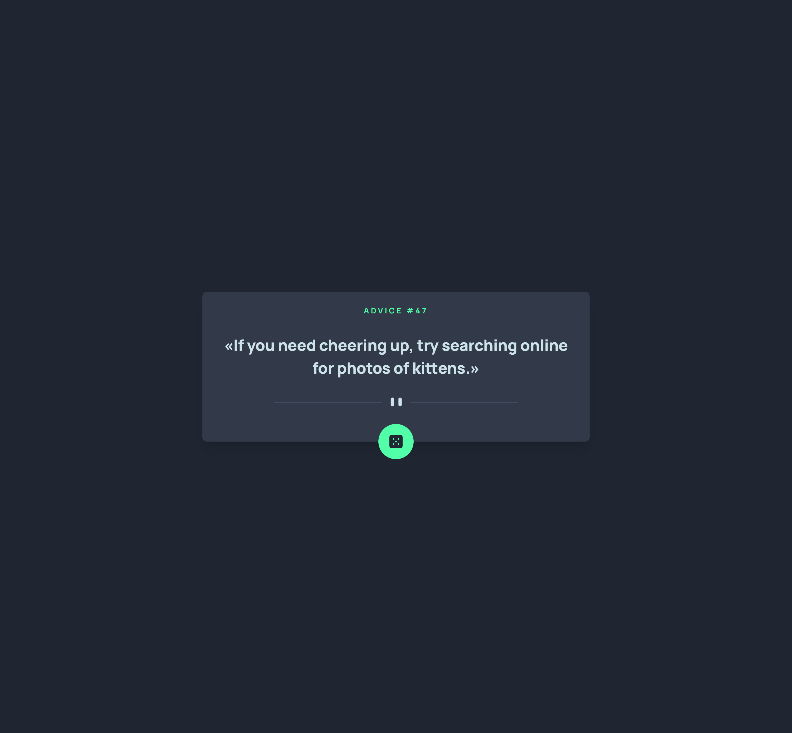

# Frontend Mentor - Advice generator app solution

This is a solution to the [Advice generator app challenge on Frontend Mentor](https://www.frontendmentor.io/challenges/advice-generator-app-QdUG-13db). Frontend Mentor challenges help you improve your coding skills by building realistic projects.

## Overview

### The challenge

Users should be able to:

- View the optimal layout for the app depending on their device's screen size
- See hover states for all interactive elements on the page
- Generate a new piece of advice by clicking the dice icon

### Screenshot

### Links

- Solution URL: [https://www.frontendmentor.io/solutions/advice-generator-react-typescript-tailwind-AFH3_KLh7z](https://www.frontendmentor.io/solutions/advice-generator-react-typescript-tailwind-AFH3_KLh7z)
- Live Site URL: [https://dev-paull.github.io/advice-generator/](https://dev-paull.github.io/advice-generator/)

## My process

- 🖼️ Analyzed screenshots and instructions to understand design and functionality requirements
- 🎨 Imported necessary colors and assets into the project for UI styling
- 📱 Adopted a **mobile-first** approach
- 💬 Implemented the Advice Slip API to fetch and display random advice dynamically
- 🖥️ Adapted the UI to match the **desktop design**
- 🚀 Deployed the project to **GitHub Pages**
- 🖱️ Added a **hover state** effect to the button and made other minor UI fixes to enhance user experience

**React, Typescript, Tailwind, Vite**
